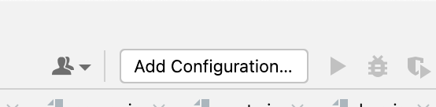
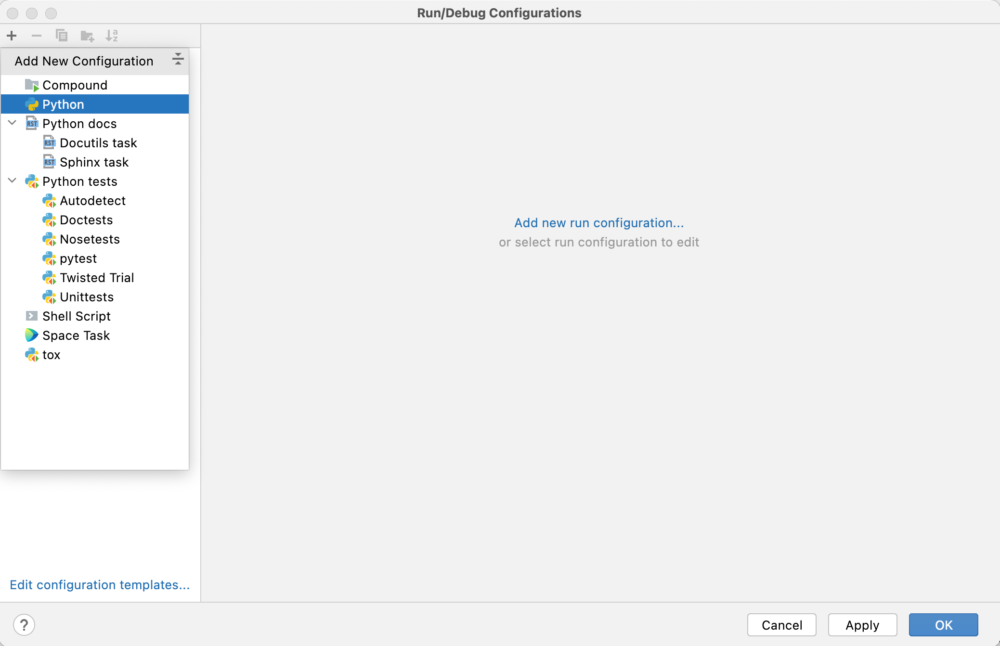
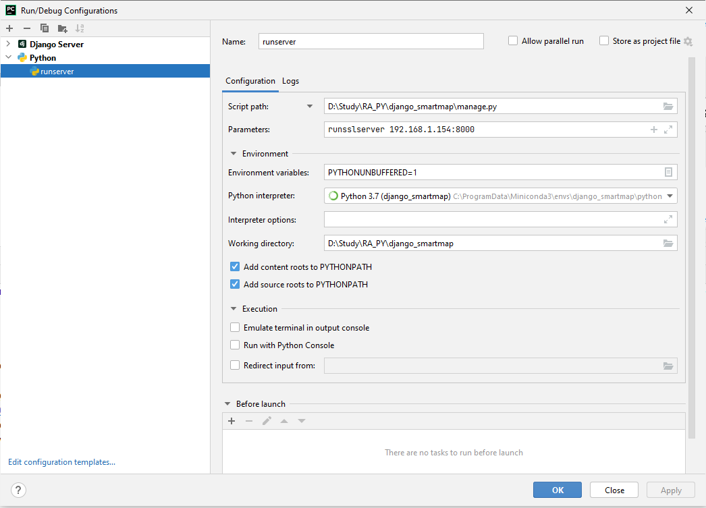
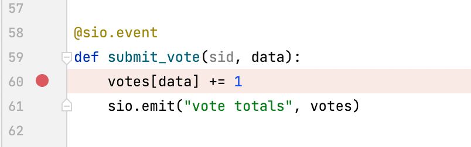
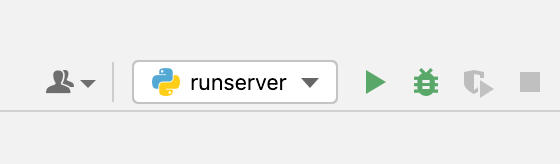
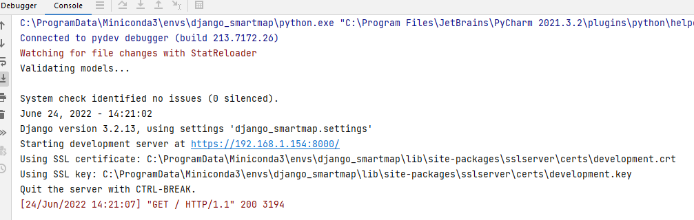
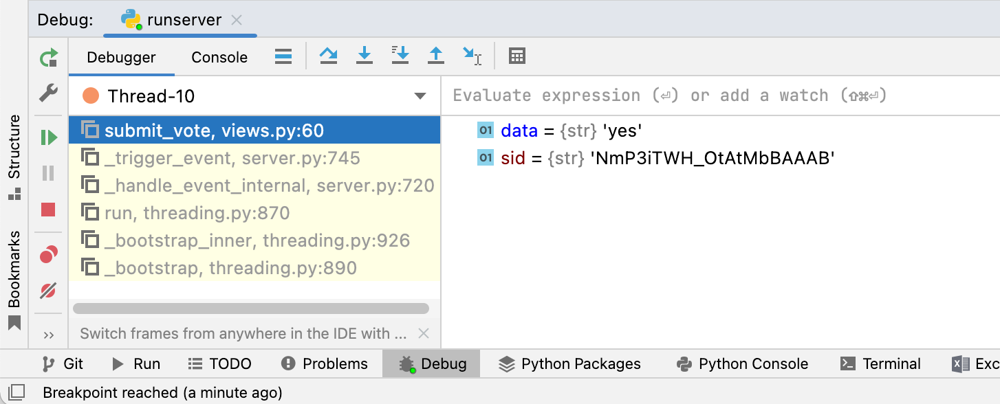
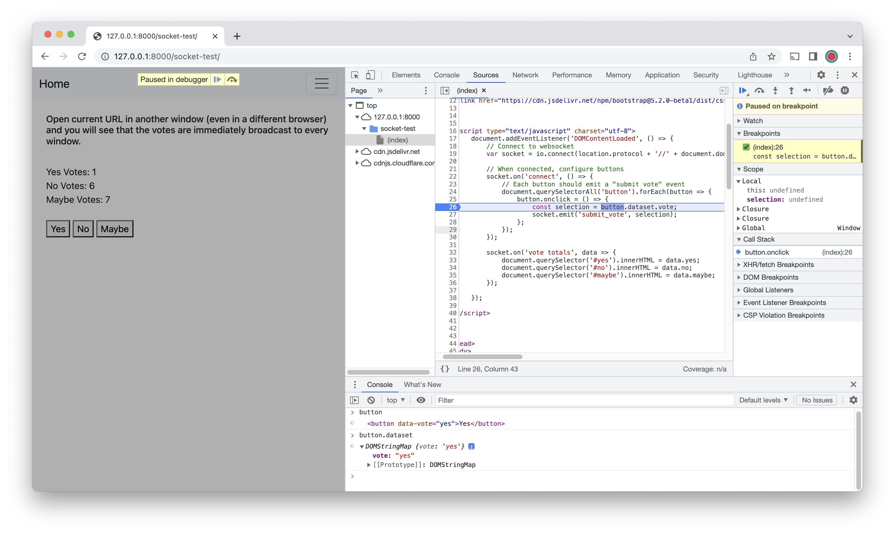

# Django Smart Map Project

---
### Installation
1. Download PyCharm Professional Edition
2. Get educational license: https://www.jetbrains.com/community/education/#students
3. I recommend installing Miniconda as your Python interpreter: https://docs.conda.io/projects/continuumio-conda/en/latest/user-guide/install/index.html 
4. Clone this repository in PyCharm and create your own branch for development
5. Open a terminal in PyCharm and execute the following
   1. pip install django
   2. pip install python-socketio
6. (Optional) insert Google API key near bottom of django_transit/settings.py

### Run the Server
In a PyCharm terminal execute the following.
<li>python manage.py runserver

***

### Debugging
(The following images don't appear on GitHub, but they will in PyCharm)
  

#### Debug Python code
Click 'Add Configuration...' at top of PyCharm window.

  
Click the "+" symbol at the top left. Select 'Python'.

  
Setup the configuration as shown. Set 'Script path' to your project's manage.py script.

  
Click in a file's gutter to add a breakpoint.

  
Click the green bug icon to run the server in debug mode. (You can use the green play button for regular mode.)

  
Click the server URL in the debug window output (or right-click it and select Chrome for javascript debugging).

  
Interact with the website to hit a breakpoint. Use the controls and tools in the debug window to step through the code and evaluate expressions.

#### Debug Javascript code
The easiest way right now is to open the server in Chrome. 
1. Similar to the Python debug steps, run the server but open the URL in Chrome. You can right-click on the URL and select Chrome.

2. Navigate to the Sources tab.
3. Click the file in the Page pane.
4. Set breakpoints by clicking in the file's gutter.
5. Step through the code using the buttons at the top of the righthand pane.
6. Evaluate expressions in the Console window at the bottom.

