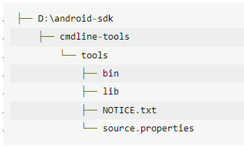

# Django Smart Map Project

---

### Installation

1. Download PyCharm Professional Edition
2. Get educational license: https://www.jetbrains.com/community/education/#students
3. Clone this repository in PyCharm and create your own branch for development
4. Open a terminal in PyCharm and execute the following
    1. pip install -r requirements.txt
5. Install Docker Desktop for your OS from https://www.docker.com/products/docker-desktop/
   1. On Windows, if the docker installation didn't prompt you to install the WSL 2 Kernel package update, Follow the instructions available at https://docs.microsoft.com/en-gb/windows/wsl/install-manual#step-4---download-the-linux-kernel-update-package
      to install and configure it. (Step 6 - Install your Linux distribution of choice is not required.)
   2. Create a basic docker account and sign in.
6. Before we start working with Docker, make sure that the Docker plugin is enabled. 
   The plugin is bundled with PyCharm and is activated by default. 
   If the plugin is not activated, enable it on the Plugins page of the IDE settings **Ctrl+Alt+S** as described in https://www.jetbrains.com/help/pycharm/managing-plugins.html.

If you have trouble with any of these steps, message me on discord.

### Google Cloud Build CI/CD
The master branch is configured to google cloud build CI/CD. A new build will be created and deployed when ever a new commit happens to this branch. In some cases, you may want to make a change to your source code but you don't want to invoke a build. For example, you might not want to invoke a build when you update documentation or configuration files.
In such scenarios, you can include **[skip ci]** or **[ci skip]** in the commit message, and a build will not be invoked.
If you want to run a build on that commit later, use the Run trigger button in the Triggers page

***

### Running/Debugging

#### Setup Python Interpreter

1. Press **Ctrl+Alt+S** to open the IDE settings and select **Build, Execution, Deployment | Docker**.

2. Click **+** to create a Docker server. Accept the suggested default values:
  
    
  
3. Select **Project:django_smartmap | Python Interpreter**. Click the gear icon (highlighted below) and select Add
       
#### Interpreter 1
4. Click Docker Compose and select **smart_map** for the service option from the drop down. Click OK
    
#### Interpreter 2
5. Add one more interpreter for the PROD settings by following the same steps except selecting the 
 **smart_map_cloud** option for service this time. Click OK
    

#### Setup Debug/Run Configuration

1. Two django project configurations named **Django_DEV** and **Django_PROD** will be available with the project.
Click the edit configurations in the top right corner of the IDE.
    

2. Make sure to select the Python Interpreter you created in the previous section is selected
   against the interpreter option for both DEV ([Interpreter-1](#interpreter-1)) and PROD ([Interpreter-2](#interpreter-2)) settings. Make sure rest of the settings match same as shown below.
    
    

#### Debug/Run Application
1. Click in a file's gutter to add a breakpoint.

  
2. Select an appropriate run setting (Django_DEV or Django_PROD). Click the green bug icon to run the server in debug mode. (You can use the green play button for regular mode.)

3. Make sure you select the correct interpreter from the right side corner of the IDE according to the 
   runsettings you select.
   1. Select [Interpreter-1](#interpreter-1) for Django_DEV
   2. Select [Interpreter-2](#interpreter-2) for Django_PROD
  
  
4. Select **Run manage.py Task** from Tools menu.  

  
5. Run **makemigrations** and **migrate** respectively in the window opened.  
  
6. Click the link http://0.0.0.0:8000/ to access the application.  

  
7. Interact with the website to hit a breakpoint. Use the controls and tools in the debug window to step through the code
and evaluate expressions.

#### Debug Javascript code

The easiest way right now is to open the server in Chrome.

1. Similar to the Python debug steps, run the server but open the URL in Chrome. You can right-click on the URL and
   select Chrome.

2. Navigate to the Sources tab.
3. Click the file in the Page pane.
4. Set breakpoints by clicking in the file's gutter.
5. Step through the code using the buttons at the top of the right-side pane.
6. Evaluate expressions in the Console window at the bottom.
   

### Installing Android Device Emulator For Testing
#### Method 1 Without Android Studio [Windows x64]
1. Download and install [JDK](https://download.oracle.com/java/18/latest/jdk-18_windows-x64_bin.msi "JDK").
2. Set JAVA_HOME variable.
	Open Command Prompt (Win+R, type cmd and press Enter) or use any other terminal you like. For me path to JDK is `E:\Program Files\Java\jdk1.8.0_251.` Execute the following:
	  	`setx JAVA_HOME "E:\Program Files\Java\jdk1.8.0_251"`  
3. Download and install [Intel Hardware Accelerated Execution Manager (HAXM)](https://github.com/intel/haxm/releases/download/v7.7.1/haxm-windows_v7_7_1.zip "Intel Hardware Accelerated Execution Manager (HAXM)") if not already present in your system (you also need to switch off Hyper-V feature and enable Virtualization in BIOS for successful installation).
4. Download [Command-Line-Tools](https://dl.google.com/android/repository/commandlinetools-win-8512546_latest.zip "Command-Line-Tools")
5. Now create a folder to store the sdk files. This can be done in some drive were you have enough space. Mine is
		`D:\android-sdk`  
	5.1 Extarct the contents of the file downloaded in step 4 in this directory. After this, the folder structure should look like this.
    
	If yours is not shown like the above structure, make it as shown above.
6. Set ANDROID_SDK_ROOT environment variable:
		  `setx ANDROID_SDK_ROOT D:\android-sdk`  
7. Create new entry in Path environment variable:
	  	`setx path "%PATH%;%ANDROID_SDK_ROOT%\cmdline-tools\tools\bin" /m`  
	Note: you'll probably need to restart cmd in order the changes take effect.
8. Open CMD in directory **D:\android-sdk\cmdline-tools\tools\bin**  
	8.1 Execute the below command. You can change the **android-29** with some other version which you want. You can see all the available versions [here](https://developer.android.com/studio/releases/platforms "here").
			  `sdkmanager "platforms;android-29" "system-images;android-29;google_apis;x86_64" "platform-tools"`  
	Note: This may take some time.  
	8.2 Next we have to accept a bunch of licenses. Type the next command and answer y to each question:
			  `sdkmanager --licenses`  
	8.3 Now we are ready to create new virtual device:
		  	`avdmanager create avd -n test_avd_29 -k "system-images;android-29;google_apis;x86_64"`  
	You can change the ADV name from **test_avd_29** to something else if you wish. Also make sure you use the same android sdk version you downloaded in the previous step in place of **android-29**.
	  8.4 To see the list of virtual devices just type:
		  `avdmanager list avd`  
9. Go to emulator folder:
		  `cd %ANDROID_SDK_ROOT%\emulator`  
10. Last but not least thing is launching:
		  `emulator -avd test_avd_29`  
	Note: This may take sometime.

  
Reference : https://dev.to/andreisfedotov/how-to-install-android-emulator-without-installing-android-studio-3lce

#### Method 2 With Android Studio

1. Download and install the latest android studio from https://developer.android.com/studio#downloads.
2. Launch Android Studio.
3. Select the Virtual Device Manager Option  
   
     
4. Click On create Device  
     
5. Select an appropriate device as shown in the image below and click next.  
     
6. Select a system image. Download if required. Click Next  
     
7. Give an appropriate name and click Finish  
     
8. Once the device is created, it will be available at the window we saw in step 3. Click on the Play button available
   next to the device that you created in the previous step to boot it up.  

     

9. Once the device boots up, Click the 3 dots on the right bottom corner to open the settings.  
     
10. Select Location option on the left side. Select the routes tab on the right side. Add a source and destination as we
    do it Google Maps. Click Save Route.  
      
11. Select the route that you created in the previous step from the saved routes option and click the Play Route button
    on the right bottom corner. Make sure **Enable GPS Signal** toggle is ON.  
      

12. Now go back to the android device screen and open our web app URL from the device. Navigate to the map tab and
    select a route. Now you can see the bus Moving on the map tab (In your browser window).  
    

